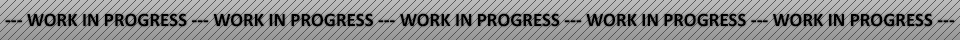
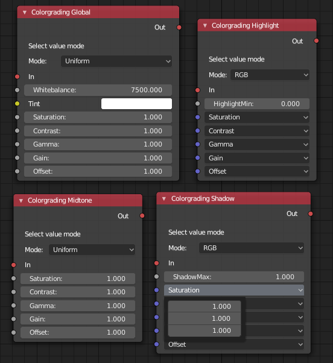

## Post-Processing Module
Post-Processing Module (Formerly Post-Processing Volumes) is an addon for Armory3D that implements realtime colorgrading and implements both existing and new shaders as uniforms that can be fully controlled both through Haxe and through Logic Nodes.

## Version 0.1:
- Version 0.1 is the first version after refactoring, that implements fully working colorgrading for all luminance intensities, as well as per color channel selection. I intend to be more structured with this addon than I was earlier, as such a lot of realtime uniforms and shaders have been removed temporarily. They will be added gradually. For the old code, please refer to the commit history caches. Version is compatible with Armory 0.6



A selection of the currently available nodes.

## Why as an addon?
I'd rather not commit something to Armory that is still bugged and not as optimized as possible. Still lots of things to do to make it useful. This is compatible with the Armory 0.6 version - This addon might break Armory. Bugs should be reported on this github section rather than the main Armory repo.

## How to - Installation

Simply copy and paste the **armsdk** folder directly into your Armory/Blender main folder and it will expose and implement the controls straight away. In order to include the uniforms and include the shader code, toggle on "PPM" in the renderpath.

## How to - With Logic Nodes

- Open up blender, make a quick scene
- Add a new renderpath, and make sure to toggle "PPM" under Armory Render Path > Renderer
- Create a new node tree and attach it to your objects
- Add the colorgrading node you want (Colograding Global for example)
- Attach an event or input node (On Init for example) and plug it in
- Adjust your settings for the PPM node to your liking
- Press F5 to run. Simple as that.

## How to - With Haxe
- Open up blender, make a quick scene
- Add a new renderpath, and make sure to toggle "PPM" under Armory Render Path > Renderer

The PPM uniform values are directly accessible as public arrays inside the PPM.hx file. For instance, if you want to change the global contrast uniform, it is accessible from the **colorgrading_global_uniforms** array. A simple haxe script
example of changing this would look like this:

```haxe
package arm;

class PPM_Test extends iron.Trait {
	public function new() {
		super();

		 notifyOnInit(function() {
			 armory.renderpath.PPM.colorgrading_global_uniforms[3][0] = 2.0;
			 armory.renderpath.PPM.colorgrading_global_uniforms[3][1] = 0.5;
			 armory.renderpath.PPM.colorgrading_global_uniforms[3][2] = 0.0;
		 });

	}
}
```

The result of the above would leave you with frame that has an red-orangey hue to it, due to the red channel being most prominent. The contrast vector is the third [3] array element, with the subsequent 0,1,2 array keys indicating the Red [0], Green [1] and Blue [2] color channels. For a full list of the uniforms and their corresponding keys, please refer to the PPM.hx file - The keys and uniforms are commented in the file.


## Future plans:
- Library version: Add a drag&drop library version of this.
- Add auxiliary helper nodes: Organize in Get/Set nodes, add transition nodes, PPM blending nodes and possibly more.
- More documentation: Pretty self-explanatory.
- More examples: Will make a separate repo at some point.
- More uniforms: Gradually add uniforms for SSR, Bloom, AO, VXGI, Compositor Effects, SH/Env/Indirect and more.
- More shaders: I have a couple of WIP shaders, such as chromatic aberration, HQ Bloom, Preetham Sky, Dirt Lens that I am still working on. Should come along with time.


Example from some of the possible effects (screencap from early WIP version):


=======